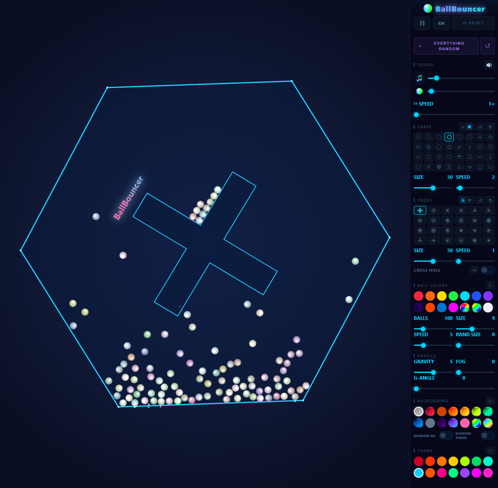
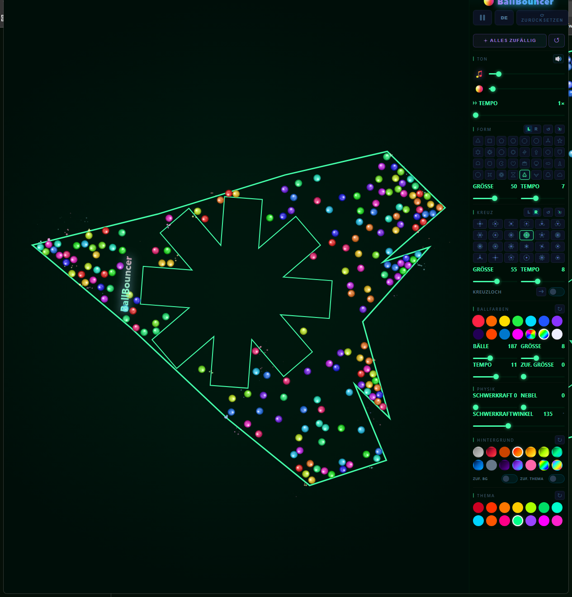

# BallBouncer

A small physics toy that runs in the browser. Balls bounce around inside a spinning shape while you mess with gravity, rotation, colors and sound.

**[Try it here](https://ballbouncer.vercel.app)**

## Screenshots

| Default view | Everything Random |
|---|---|
|  |  |

The panel on the right controls everything. The random button rerolls the shape, cross, colors and background in one click.

## What it does

- 32 outer shapes (polygons, stars, plus things like a heart, ghost, rocket and skull) and 24 inner cross shapes that spin independently.
- Adjustable gravity strength and direction — you can flip it sideways or upside down.
- An optional gap in the cross that balls can fall through. It can step to the next arm manually or cycle on a timer.
- 14 color themes, 14 ball palettes and 14 background styles, mixed and matched however you like.
- A generative ambient soundtrack plus a short tone on each ball hit, panned by where the ball is.
- Trails, a fog effect, and per-ball spin that you can actually see on the highlight.
- Runs at 60 FPS with a few hundred balls; scales down cleanly on phones.
- UI translated into 8 languages (EN, DE, ES, FR, IT, PT, JA, ZH).

## Controls

Balls spawn on their own. From there:

- Drag the **Gravity** and **Spin** sliders and watch the motion change.
- Pick a shape or cross from the grids, or hit the dice button next to each to randomize just that one.
- **Everything Random** rerolls the whole scene. **↺ Cycle** keeps changing it on its own every few seconds.
- Sliders for ball count, size, speed and randomness are under "Ball Colors".

Your shape, physics and sound settings are saved in `localStorage`. The color themes reroll on each visit, so it looks a little different every time you open it.

## Privacy

Everything runs in your browser. Settings stay on your device in `localStorage` — no accounts, no cookies, no personal data collected. The hosted version uses Vercel's cookieless, anonymized page analytics.

## Built with

- Plain JavaScript, no frameworks.
- HTML5 Canvas 2D for rendering, with cached ball sprites and an offscreen background layer.
- The Web Audio API for the synth and hit sounds.
- Hosted on Vercel.
