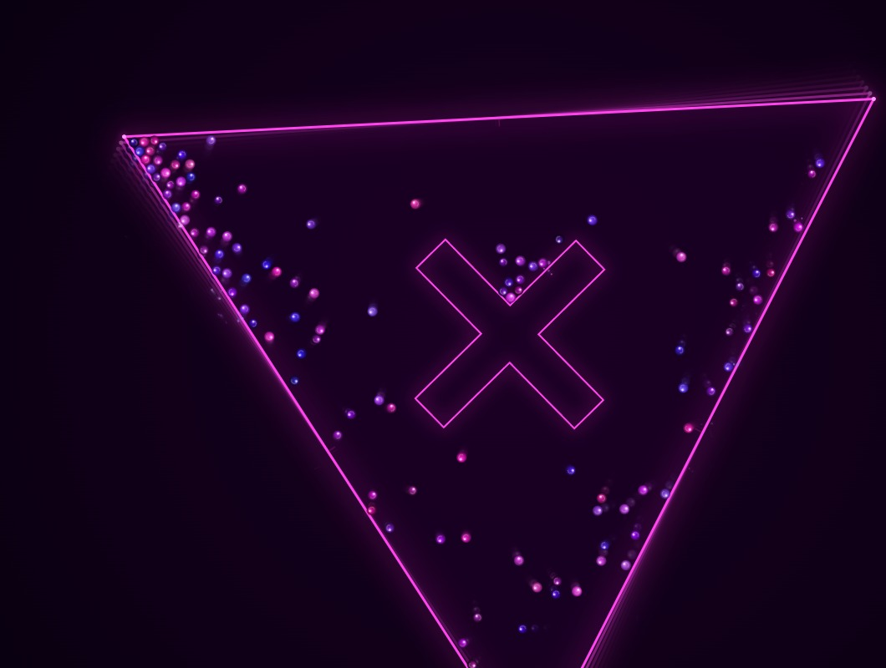
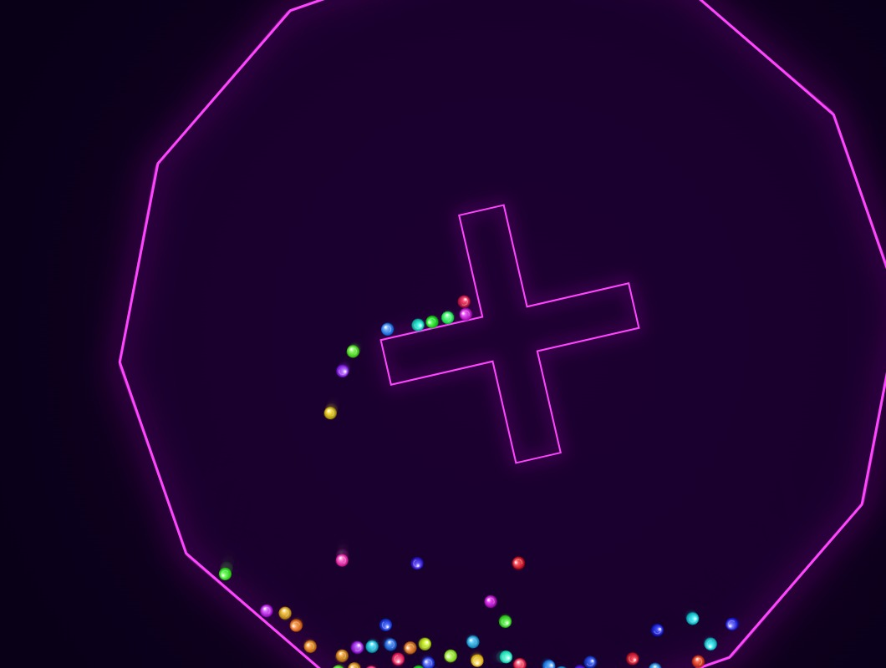
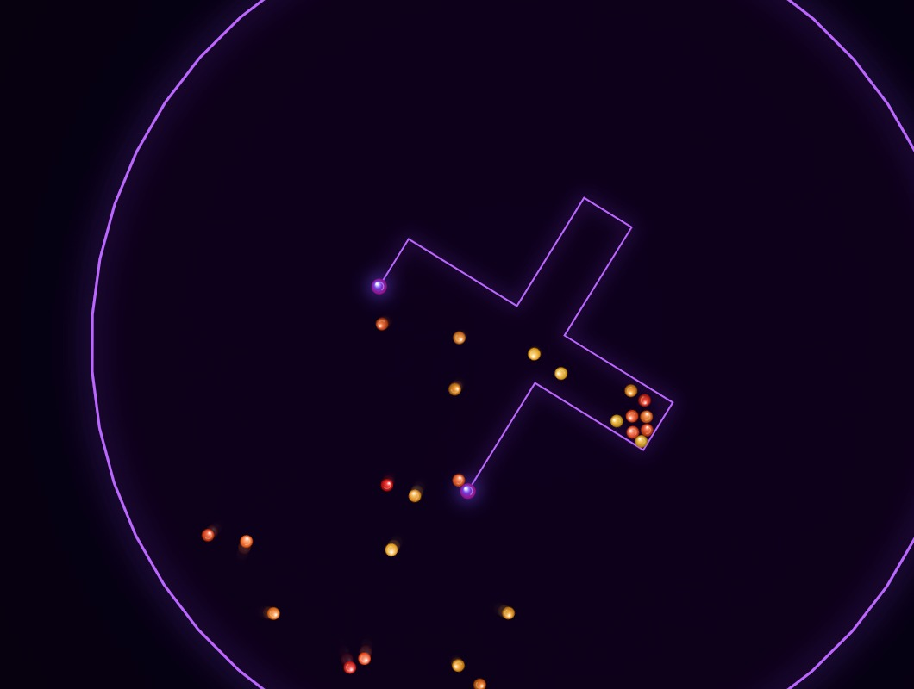

# 🎱 BallBouncer

**A high-performance physics playground** — launch hundreds of balls into spinning geometric worlds. Fine-tune gravity, rotation, and psychedelic visual effects in real-time.

🔗 **[Live Demo](https://ballbouncer.vercel.app)**

---

## Screenshots

| High-Speed Action | Mobile UI | Complex Geometry |
|--------|-----------|--------|
|  |  |  |

---

## What makes BallBouncer special?

- **Butter-Smooth Performance:** Optimized for 60 FPS on everything from desktop workstations to older smartphones.
- **Infinite Variety:** 32 hand-crafted outer shapes and 24 inner cross patterns combine with 14 color themes for billions of possibilities.
- **Interactive Physics:** Change gravity's strength and direction, tweak spin speeds, and let balls escape through dynamic holes.
- **Generative Soundscape:** Every impact creates a spatial, reverb-soaked note that forms a unique ambient melody.
- **Zero Friction:** No installs, no loading screens. Just physics.

---

## ⚙️ Features at a Glance

### Physics
- **32 Shapes:** Polygons, stars, and characters like Ghost, Cat, and Rocket.
- **24 Crosses:** From simple plus-signs to complex Snowflake and Triquetra patterns.
- **Dynamic Gravity:** Drag the G-Angle to flip gravity sideways or upside down.
- **Hole Logic:** Configurable gaps that cycle between arms manually or automatically.
- **Collision Sparks:** High-speed bursts that obey world physics.

### Visuals & UI
- **14 Themes:** Neon, SciFi, Aurora, and more with instant switching.
- **Bézier Trails:** Smooth comet trails that trace every ball's journey.
- **Responsive Design:** A mobile-first UI with a clean settings overlay and touch-friendly controls.
- **Retina Ready:** Full HiDPI support for razor-sharp rendering on high-resolution screens.
- **Multi-language:** Localized into 8 languages (EN, DE, ES, FR, IT, PT, JA, ZH).

---

## 🕹️ How to Play

1. **Watch it go:** Balls spawn automatically. Watch how they react to the spinning world.
2. **Experiment:** Drag the **Gravity** and **Spin** sliders to see how the motion changes.
3. **Get Wild:** Hit the **Everything Random** button for a completely new setup.
4. **Auto-Pilot:** Enable the **↺ Cycle** button to let the world evolve on its own every few seconds.

---

## 🛠️ Tech Stack

- **Vanilla JavaScript:** Zero dependencies, pure logic.
- **HTML5 Canvas 2D:** Optimized rendering with vertex pooling.
- **Web Audio API:** Real-time synthesis and spatial audio processing.
- **Vercel:** Globally distributed edge hosting.
